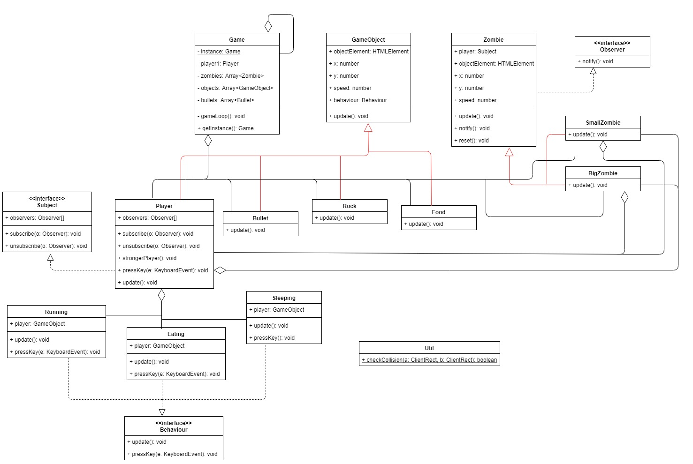

# Inleverdocument PRG01-8

## Inleiding

De player is een kleine soldaat die je kan besturen met de pijltjestoetsen. De soldaat kan ook schieten. Met een druk op de spatietoets kan de soldaat schieten. Het is de bedoeling om de zombies in het spel neer te schieten. Als alle zombies zijn neergeschoten, heeft de player van het spel gewonnen. Echter heeft de soldaat maar 2 levens. Door eten (kersen) te pakken, kan daar een leven bijkomen. De zombies schrikken als de soldaat eet en sterker is geworden. Hierdoor krimpen de zombies. Ze zijn daardoor moeilijker te raken. Als de soldaat in botsing komt met een zombie of een rots, dan gaat er een leven van af. Als de soldaat geen levens meer heeft, dan is het game over.

## Speelbare game

https://basd92.github.io/battle-game/

## Installatie

Via deze repository kan je het project clonen. De clone doe je in de root map van een lokale server, zoals XAMPP of MAMP. Het editen kan in Visual Studio Code. Als het project daar is geopend kan je "Ctrl+Shift+B" intoetsen en de "watch-mode" aanzetten. Hierdoor compileren de Typescript bestanden automatisch naar ES5 (JavaScript) bij een wijziging in de code. Door het compileren is de code leesbaar voor de browser. De game kan je runnen en spelen door deze link aan te houden: http://localhost/battle-game/docs/index.html

## Klassendiagram



## Pull request

Link pull request naar Olcay: https://github.com/Olcay4/prog8project/pull/1 (Singleton geïmplementeerd in Game class en Game loop toegevoegd)
Link fork: https://github.com/BasD92/prog8project

## Peer review

Link peer review: https://github.com/Olcay4/prog8project/issues/2

## Singleton

Ik heb Singleton toegepast in de Game class. Van de Game class hoeft maar 1 object gemaakt te worden. Als het scherm laadt, dan wordt er 1 Game object aangemaakt, doordat de Game class de static method 'getInstance' aanroept en deze method controleert of er een object is aangemaakt. Als er al een object is aangemaakt, vindt er een return plaats, als er nog geen object is aangemaakt, dan maakt deze static method het object aan. De constructor van Game is private.

```
private static instance: Game;

private constructor() {}

public static getInstance(): Game {
  if (!Game.instance) {
    Game.instance = new Game();
  }
  return Game.instance;
}
```

## Polymorfisme

In de Game class heb ik een array gemaakt waarin verschillende objecten zitten die overerven van GameObject. Door middel van een loop worden 2 Food en Rock objecten "gepusht" in de array. Met een for loop kan ik met de objecten allemaal de update() method (en andere methods) aanroepen en collisions controleren. Om specifiek een method aan te roepen per object gebruik ik 'instanceof'. Hetzelfde geldt voor de Zombies. Er zijn 2 verschillende Zombie classes (SmallZombie en BigZombie) die erven van Zombie. Deze zitten in een array. Met tevens een for loop roep ik voor alle objecten de update() method (en andere methods) aan en controleer collisions.

```
for (this.i = 0; this.i < 2; this.i++) {
  this.zombies.push(new SmallZombie(this.player1));
  this.zombies.push(new BigZombie(this.player1));
}

for (this.x = 0; this.x < 2; this.x++) {
  this.objects.push(new Food());
  this.objects.push(new Rock());
}

for (let zombie of this.zombies) {
  zombie.update();
}
```

## Strategy

De Player heeft verschillend gedrag, namelijk Running, Eating en Sleeping. Alle gedrag classes implementeren van de Behaviour interface. Het standaard gedrag van de Player is Running, maar door bepaalde situaties, zoals het pakken van kersen en botsen tegen rotsen, verandert het gedrag. Bij het pakken van kersen wordt de Player groter en sneller voor 5 seconden. Als de Player tegen een rots aanbotst, dan wordt de Player terug op de startpositie gezet en heeft 1 seconden slaap nodig door de duizeligheid. Door gedrag in verschillende classes te zetten is de code in Player zelf meer overzichtelijk en is het eenvoudiger om gedrag erbij te voegen.

```
for (let object of this.objects) {
  object.update();

  if (object instanceof Food) {
    if (Util.checkCollision(this.player1.getRectangle(), object.getRectangle())) {
      this.player1.behaviour = new Eating(this.player1);
    }
  }
}
```

## Observer

Het observer pattern heb ik toegepast om een notificatie te sturen naar de zombies als de soldaat heeft gegeten. Hierdoor is de soldaat sterker en krimpen de zombies van de schrik. Op deze manier kunnen alle zombies tegelijk reageren. Player implementeert de Subject interface. Hierdoor heeft Player een lijst met observers, een subscribe() en unsubscribe() method. Zombie implementeert van de Observer interface. De notify() method is daarom toegevoegd aan de Zombie. Ook heeft de Zombie een Subject (Player), zodat de zombies zich kunnen 'subscriben' en pushen in de observers array. Wanneer de kogel de zombie raakt, verdwijnt de zombie uit het spel en dus ook uit de observers array. Dit gebeurt door na een collision de unsubscribe() method te gebruiken. In de Game class wordt bijgehouden wanneer de soldaat eet en sterker wordt. Als dit het geval is wordt de strongerPlayer() method van het Player object aangeroepen. Deze geeft met de notify() method aan alle observers door dat de soldaat sterker is geworden. Uit angst voor de soldaat krimpen daarom de zombies.

```
public notify(): void {
  // All zombies are shrinking
  this.height -= 10;
  this.width -= 10;
}

for (let bullet of this.bullets) {
  if (Util.checkCollision(bullet.getRectangle(), zombie.getRectangle())) {
    this.player1.unsubscribe(zombie);
  }
}
```

## Gameplay componenten

